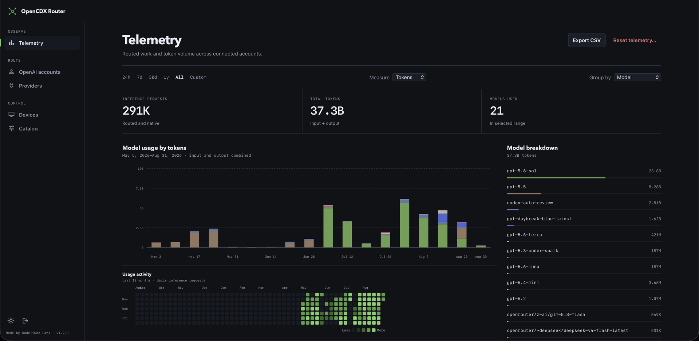
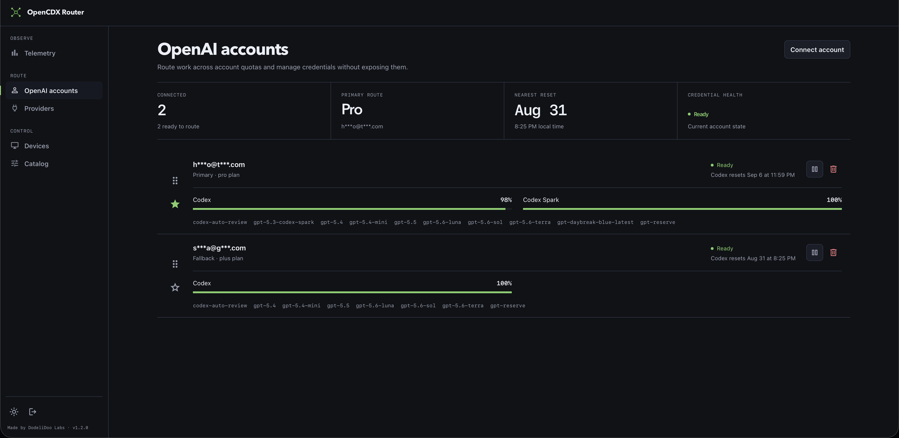
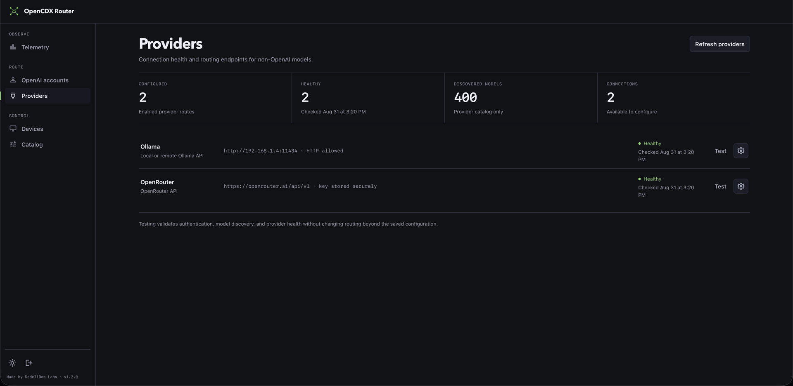
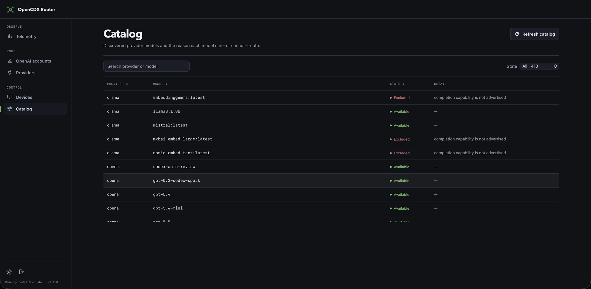
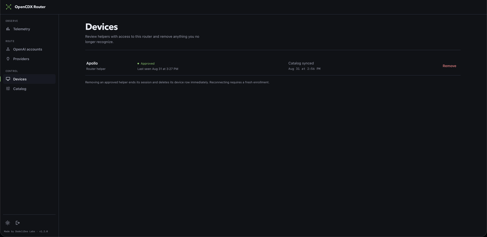
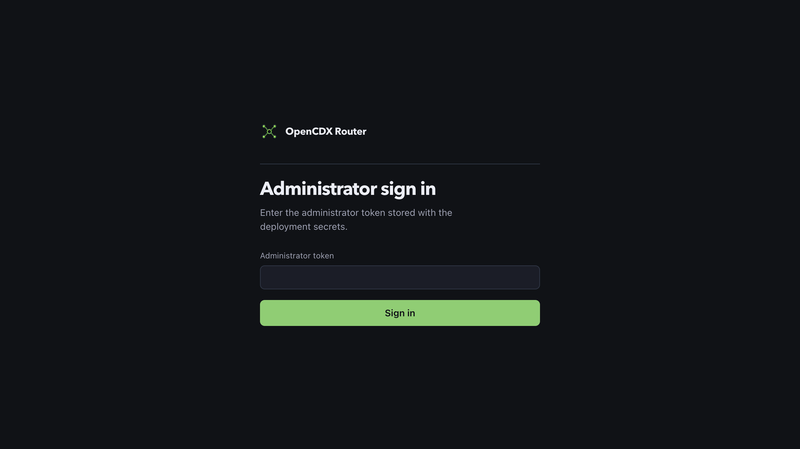
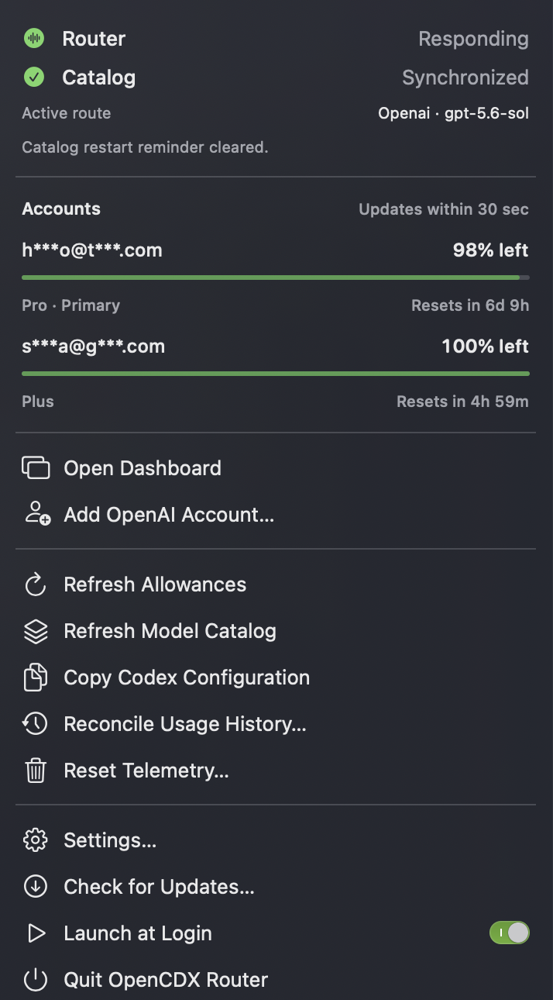
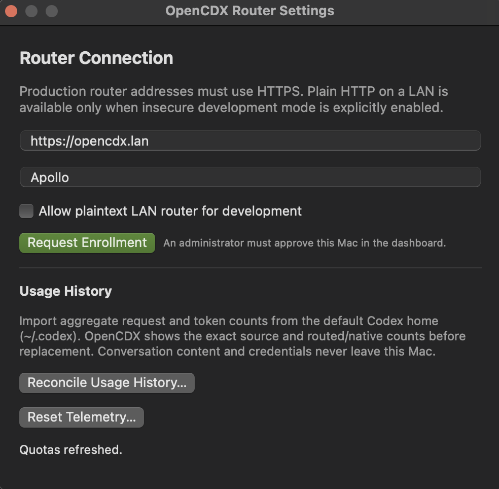

<p align="center">
  
</p>

<h1 align="center">OpenCDX Router</h1>

<p align="center">
  A self-hosted provider router for Codex with multi-account routing, quota-aware failover, provider catalogs, and private aggregate telemetry.
</p>

<p align="center">
  <a href="https://github.com/Dodelidoo-Labs/open-cdx/releases/latest">Download the macOS app</a>
  ·
  <a href="https://github.com/Dodelidoo-Labs/open-cdx/pkgs/container/open-cdx">Get the router container</a>
  ·
  <a href="docs/">Documentation</a>
</p>

OpenCDX gives Codex one local endpoint while a central router manages OpenAI accounts, provider credentials, model catalogs, quotas, and routing. Each Mac uses a native menu-bar app and a bundled loopback helper to reach the router securely.

```text
Codex → local helper → HTTPS → OpenCDX Router → OpenAI / OpenRouter / Ollama
```

OpenCDX does not replace Codex or reuse an existing Codex, ChatGPT, or browser login. Each OpenAI account is connected through a fresh browser sign-in, and OpenCDX never edits `~/.codex/config.toml` for you.

## What to download

OpenCDX has two separately distributed parts:

| Component | Download location | What it contains |
|---|---|---|
| Router service | [GitHub Packages](https://github.com/Dodelidoo-Labs/open-cdx/pkgs/container/open-cdx) | The multi-architecture Docker image at `ghcr.io/dodelidoo-labs/open-cdx` |
| macOS companion | [GitHub Releases](https://github.com/Dodelidoo-Labs/open-cdx/releases/latest) | The signed and notarized universal macOS app, including its bundled helper |

**GitHub Releases do not contain the Docker image.** The runnable release download is the macOS companion app; Docker pulls the router from GitHub Packages. Release pages also carry checksum and update-feed metadata for the Mac app.

## Highlights

- Route across multiple OpenAI accounts with an operator-selected primary account, sticky sessions, quota tracking, and automatic fallback.
- Add compatible OpenRouter and Ollama models without losing the native OpenAI catalog.
- Inspect model availability, exclusions, provider health, devices, account allowances, and reset windows from the web dashboard.
- See router health and account quota at a glance from the macOS menu bar.
- Keep OpenAI and provider credentials in encrypted router storage; paired Macs receive only revocable device credentials.
- Track daily request and token totals without storing prompts or responses.
- Reconcile aggregate usage from an existing local Codex history without sending conversation content to the router.

## Screenshots

Click any screenshot to open it at full size.

<table>
  <tr>
    <td width="50%" align="center">
      <a href="docs/assets/screenshots/telemetry.png"></a><br>
      <sub>Telemetry and model usage</sub>
    </td>
    <td width="50%" align="center">
      <a href="docs/assets/screenshots/openai-accounts.png"></a><br>
      <sub>OpenAI account routing and allowances</sub>
    </td>
  </tr>
  <tr>
    <td width="50%" align="center">
      <a href="docs/assets/screenshots/providers.png"></a><br>
      <sub>Provider health and endpoints</sub>
    </td>
    <td width="50%" align="center">
      <a href="docs/assets/screenshots/catalog.png"></a><br>
      <sub>Searchable model catalog and exclusions</sub>
    </td>
  </tr>
  <tr>
    <td width="50%" align="center">
      <a href="docs/assets/screenshots/devices.png"></a><br>
      <sub>Paired and revocable devices</sub>
    </td>
    <td width="50%" align="center">
      <a href="docs/assets/screenshots/admin-sign-in.png"></a><br>
      <sub>Administrator sign-in</sub>
    </td>
  </tr>
  <tr>
    <td width="50%" align="center">
      <a href="docs/assets/screenshots/macos-menu.png"></a><br>
      <sub>Native macOS menu-bar companion</sub>
    </td>
    <td width="50%" align="center">
      <a href="docs/assets/screenshots/macos-settings.png"></a><br>
      <sub>Router enrollment and usage-history settings</sub>
    </td>
  </tr>
</table>

## Install OpenCDX

You need:

- A host with Docker Engine and Docker Compose v2 for the router.
- A DNS name for that host, with ports 80 and 443 reachable so the included Caddy service can provide HTTPS.
- A Mac running macOS 13 or newer for the companion app. Both Apple silicon and Intel Macs are supported.
- Codex installed separately on the Mac.

### 1. Deploy the router

Clone this repository to the Docker host and create the production configuration:

```sh
git clone https://github.com/Dodelidoo-Labs/open-cdx.git
cd open-cdx
cp docker/.env.example docker/.env
```

Edit `docker/.env` with your router's DNS name and ACME email:

```dotenv
OPENCODEX_DOMAIN=router.example.com
ACME_EMAIL=you@example.com
OPENCODEX_VERSION=latest
```

Use `latest` to follow the newest stable container, or pin `OPENCODEX_VERSION` to a published version from [GitHub Packages](https://github.com/Dodelidoo-Labs/open-cdx/pkgs/container/open-cdx).

Generate the router secrets and start the HTTPS stack:

```sh
./scripts/generate-docker-secrets.sh
docker compose --env-file docker/.env -f docker/compose.production.yml pull
docker compose --env-file docker/.env -f docker/compose.production.yml up -d
docker compose --env-file docker/.env -f docker/compose.production.yml ps
```

Open `https://router.example.com/admin` and sign in with the administrator token from `docker/secrets/admin_token`.

Keep `docker/secrets/master_key` backed up separately from the Docker data volume. The database cannot recover encrypted provider credentials without that key. See the [deployment guide](docs/deployment.md) for DNS, firewall, backup, Tailscale, verification, and upgrade details.

### 2. Install the macOS companion

1. Open the [latest GitHub Release](https://github.com/Dodelidoo-Labs/open-cdx/releases/latest).
2. Download `OpenCDX-Router-<version>-macOS-universal.zip`. This is the Mac app, not the Docker router.
3. Expand the ZIP and move **OpenCDX Router.app** to `/Applications` or `~/Applications`.
4. Launch the app. It is Developer ID signed and notarized by Apple.

The app includes the correct helper binary for both Apple silicon and Intel Macs; there is no separate helper download.

### 3. Pair the Mac

1. Open **OpenCDX Router Settings** from the menu-bar app.
2. Enter the router's HTTPS address and a recognizable device name.
3. Choose **Request Enrollment**.
4. Open **Devices** in the web dashboard and approve the pending Mac.
5. Wait for the menu to show **Router — Responding** and **Catalog — Synchronized**.

Each paired Mac has its own revocable device credential. Removing a device in the dashboard immediately ends that Mac's router access.

### 4. Connect accounts and configure Codex

1. Choose **Add OpenAI Account…** in the menu app and complete the fresh browser login. Repeat for each account you want in the routing pool.
2. Optionally configure OpenRouter or Ollama from **Providers** in the dashboard.
3. Choose **Copy Codex Configuration** after the first catalog sync.
4. Paste the generated snippet into `~/.codex/config.toml` and restart Codex.

The configuration points Codex at the local helper. Codex receives a short-lived local credential; it never receives the router's stored OpenAI refresh tokens or provider API keys.

See [Helper and Codex setup](docs/helper-and-codex.md) for advanced pairing, custom Codex homes, usage reconciliation, reset behavior, helper commands, and uninstall steps.

## Updating

- **macOS companion:** choose **Check for Updates…** in the menu. Signed updates are delivered from GitHub Releases through Sparkle.
- **Router:** set `OPENCODEX_VERSION` to the desired tag, then run the production Compose `pull` and `up -d` commands again. Router images come from GitHub Packages.

Back up the router database volume and `docker/secrets/master_key` together before an upgrade. Full instructions are in [Deployment](docs/deployment.md#upgrades).

## Privacy and security

- OpenAI access and refresh tokens and provider API keys exist only in encrypted router storage and transient router memory.
- The helper binds only to the Mac's loopback interface and keeps its device credential in Keychain.
- Prompts and responses are streamed and are not logged or stored by OpenCDX.
- Telemetry contains aggregate request and token counts, not conversation content.
- Production Mac-to-router traffic must use HTTPS. Plain HTTP on a LAN is available only through an explicit development override.

Read the complete [security model](docs/security.md) for credential ownership, network boundaries, header filtering, retry rules, backup, and revocation.

## Documentation

The [documentation index](docs/README.md) separates operator, advanced-user, contributor, verification, security, and release-maintainer guides.
